# Rewatch

[](LICENSE)
[](https://github.com/gulian/rewatch/pkgs/container/rewatch)
[](https://github.com/gulian/rewatch)

A self-hosted tracker for TV shows and movies. Built as a home for TV Time refugees: it imports your full TV Time GDPR export (watch history, followed shows, ratings, watchlist) and keeps the parts of the app that mattered, without the social clutter. It also syncs both ways with Trakt.tv.

Installable PWA, multi-user, English and French, dark and light themes.

**Demo instance**: https://rewatch.fr — registrations open while capacity holds. For anything long-term, self-host: it's one command (see below).

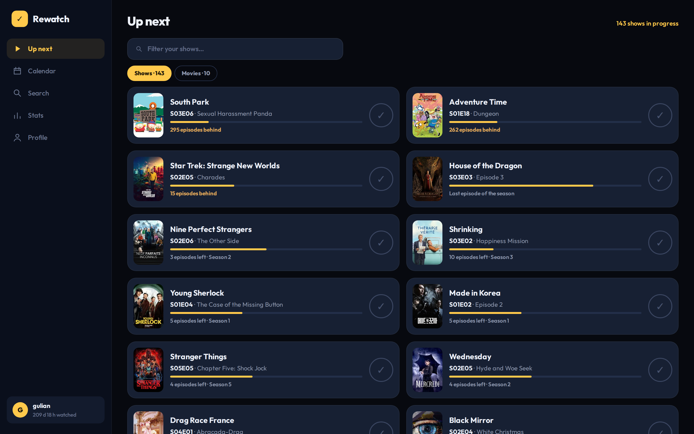

<p align="center">
  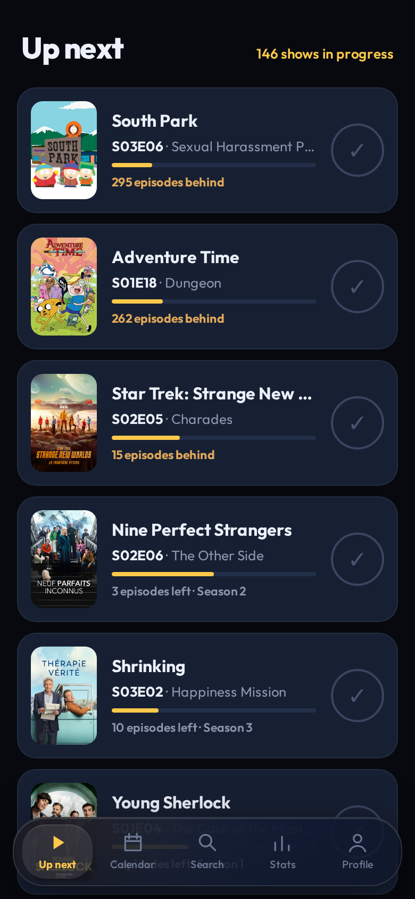
  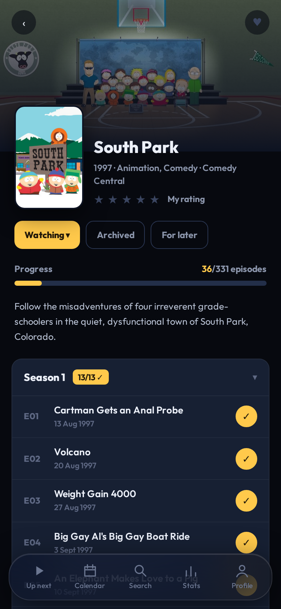
  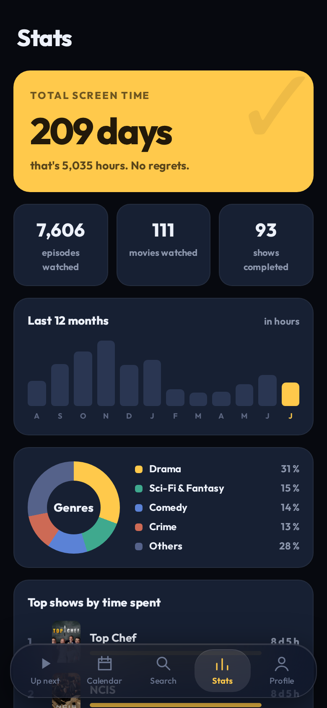
  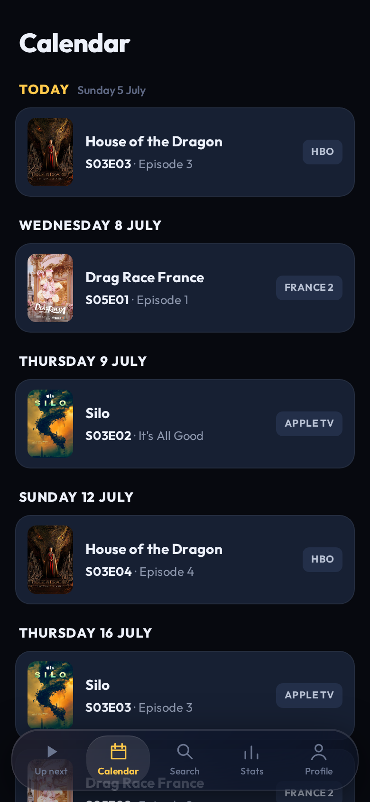
</p>

<p align="center">
  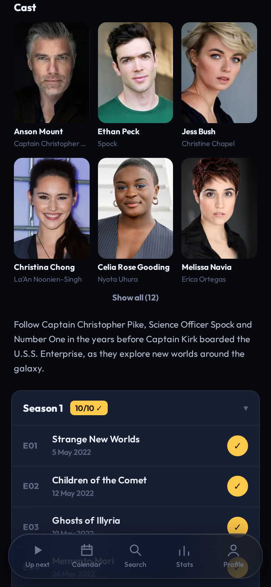
  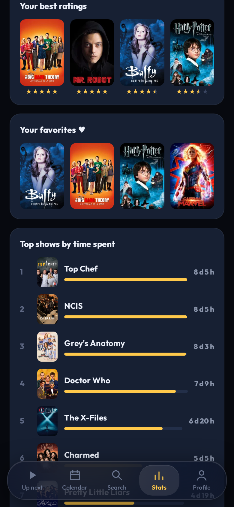
  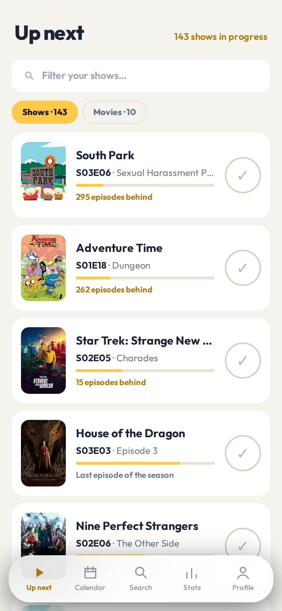
</p>

## Features

- **Episode and movie tracking** with the classic one-tap check on your next episode
- **TV Time import**: upload your GDPR export zip and get everything back — episodes, shows and their states, movies, ratings. Ambiguous movie titles go through a manual resolution screen
- **Trakt.tv sync**: import, export, and an optional live mirror of your check-ins
- **Up next** list, release **calendar**, ratings and favorites
- **Stats**: screen time, monthly activity, genres, top shows, your best-of
- **Push notifications** the day an episode airs
- **English and French**, per account — UI, emails, push messages and TMDB metadata
- **Data export**: your complete history as portable JSON with TMDB and TVDB ids
- **Admin console** with live telemetry and account management

Metadata comes from [TMDB](https://www.themoviedb.org/). You need a free TMDB API key to run an instance.

## Self-hosting

### Requirements

- Node.js 22+
- PostgreSQL 15+
- A TMDB API key ([create one here](https://www.themoviedb.org/settings/api), free)
- Optional: an SMTP account for verification/reset emails (any provider; free tiers are plenty)

### Docker (recommended)

```bash
curl -fsSL https://raw.githubusercontent.com/gulian/rewatch/master/docker-compose.yml -o docker-compose.yml
docker compose up -d
```

Open `http://localhost:3020`. **The first account you create becomes the administrator** and a setup wizard walks you through the rest: TMDB key (validated live), public URL, optional email, push keys generated in one click. No configuration file to edit.

Put an HTTPS reverse proxy in front (PWA installation and push notifications require HTTPS), and schedule the daily job once a day with cron:

```bash
docker compose exec app node dist/jobs/daily.js
```

The image is published for amd64 and arm64 at `ghcr.io/gulian/rewatch`.

### First run

Create your account: on a fresh instance it becomes the administrator, and a short wizard configures everything with live validation (TMDB key check, test email, one-click push keys). Three minutes from `docker compose up` to tracking.

<p align="center">
  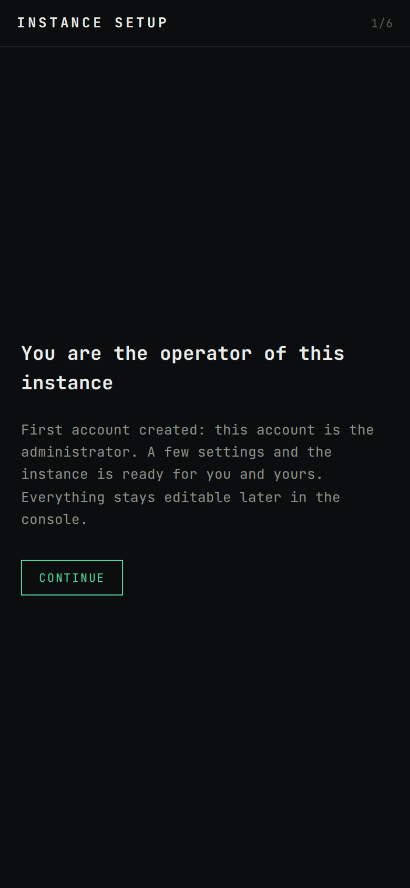
  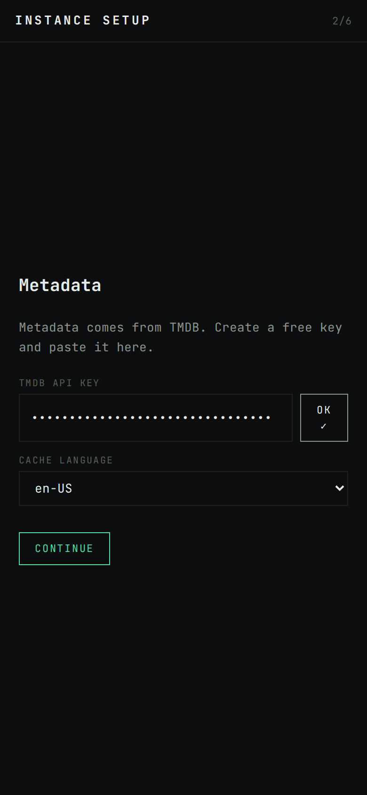
  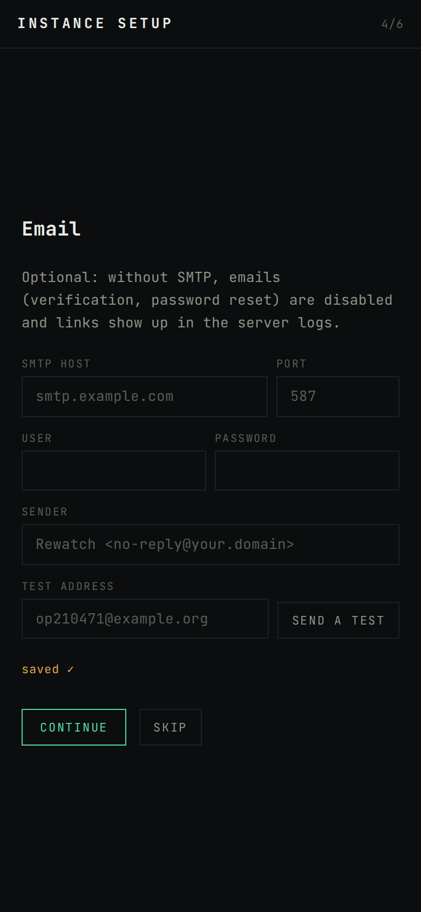
  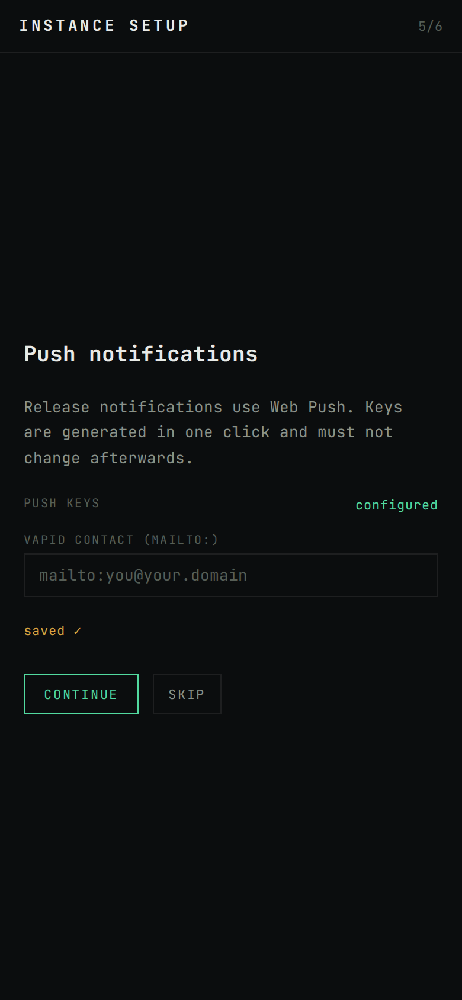
</p>

### Admin console

Operators get a dedicated console at `/admin`: live telemetry (latency percentiles, throughput, online users, slowest routes), instance settings with built-in testers, and account management.

<p align="center">
  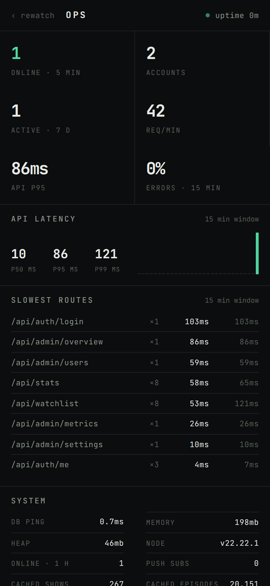
  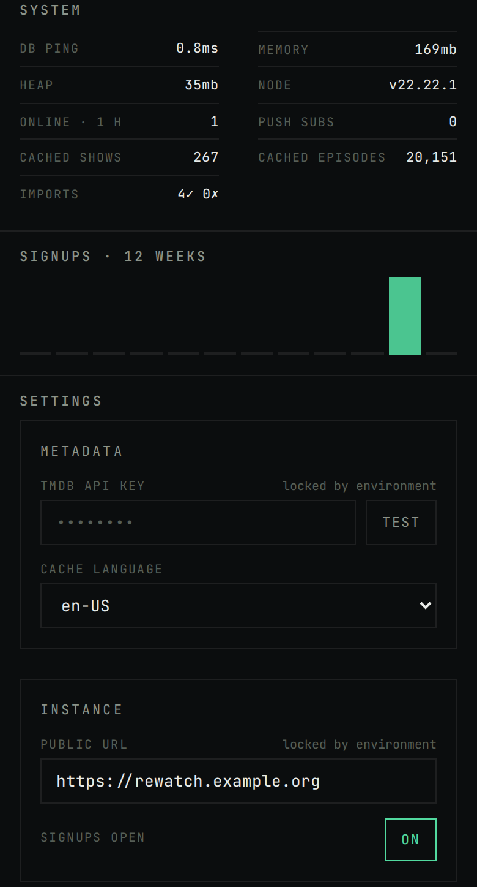
</p>

### From source

```bash
git clone https://github.com/gulian/rewatch.git
cd rewatch

# Backend — .env only needs DATABASE_URL (and PORT if you care)
cd backend
cp .env.example .env
npm ci
npx prisma migrate deploy
npm run build
node dist/server.js

# Frontend
cd ../frontend
npm ci
npm run build               # outputs to frontend/dist
```

Serve `frontend/dist` as static files and proxy `/api/` to the backend port (nginx, Caddy, or set `STATIC_DIR=../frontend/dist` to let the API serve the frontend itself). Schedule `node dist/jobs/daily.js` once a day (cron or a systemd timer): it sends the release push notifications and the verification reminder emails.

### Configuration

Everything except `DATABASE_URL` is configurable from the admin console (`/admin`, Settings panel): TMDB key and cache language, public URL, SMTP, Web Push keys, open/closed signups, and an optional privacy/legal page if your instance hosts other people. Environment variables with the same names ([`backend/.env.example`](backend/.env.example)) always take precedence when set, so config-as-code deployments work too — the console shows those values as locked.

### Admin

The first account created on a fresh instance is the administrator. Additional admins are granted directly in SQL, on purpose:

```sql
UPDATE users SET is_admin = true WHERE username = 'them';
```

The console lives at `/admin`: instance stats, live latency, settings, account management.

## Importing from TV Time

TV Time shut down in July 2026 and offered a GDPR self-service export until the end. If you have your `gdpr-data.zip`, upload it from Profile → Import: shows map through TheTVDB ids (with a name-based fallback for legacy ids), movies match by title against TMDB, and anything ambiguous lands in a resolution screen. The import is idempotent, so re-running it is safe. Format details in [docs/tvtime-export-format.md](docs/tvtime-export-format.md).

## Stack

React 19 + Vite + Tailwind 4 (PWA with a custom service worker) · Fastify 5 + Prisma 7 · PostgreSQL.

## License

[AGPL-3.0](LICENSE). If you run a modified version as a service, you must publish your changes.

---

This product uses the TMDB API but is not endorsed or certified by TMDB.
